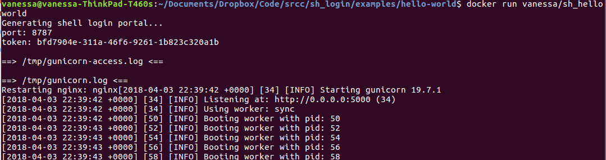
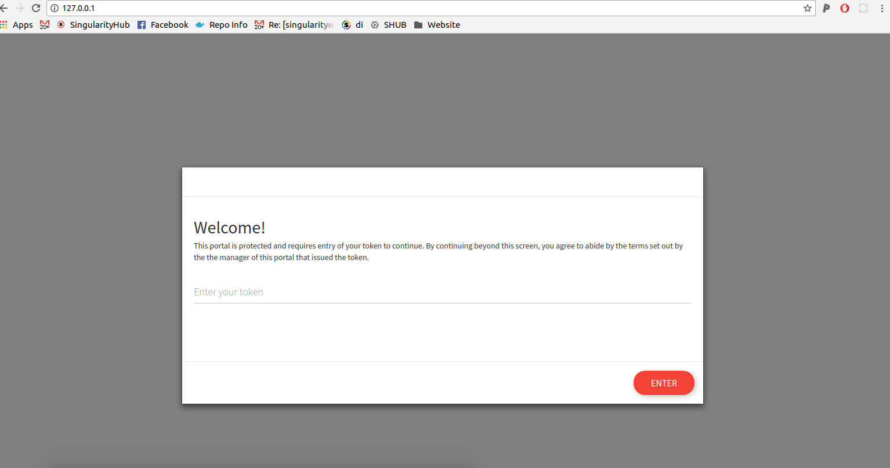
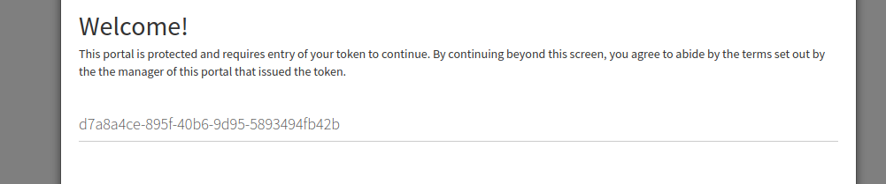
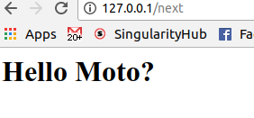

# Shell Login Portal

This is an experiment to provide a general web server to wrap access to
a particular port served by nginx. We do this by having the main nginx
root (/) serve as a proxy for the flask application, and then the Flask
application expects a particular environment variable (defined at runtime)
to check against a token provided by the user. If the token is correct,
the Flask response adds a header to authenticate it as so, and returns
the response to the user. If the response is incorrect, the user is 
returned permission denied (403). The user cannot go to the port to
bypass the application because of the proxy, and not exposing the port
directly. 

## Overview
The Dockerfile in this repository root builds the base image `vanessa/sh_login`
that can then be used for sub-applications that add some custom webby thing.
For example, we might add a jupyter notebook or rstudio server, and then call
the entrypoint to `vanessa/sh_login` with that port defined.  A dummy example 
is provided via [hello-world](examples/hello-world).  For this example, we build 
a docker image (with `vanessa/sh_login` as the base) that is rather stupid, it
just starts a local web server on port 8787, and then runs the entrypoint 
provided by `vanessa/sh_login`. The user interaction looks like this:

The container is started in some terminal environment. Here is where the
token (and optionally port) are generated on the fly, and shown to the user.



Starting the container and going to localhost shows a login screen requesting
a token.



The user now needs to enter the token they just saw.



If the token is wrong here, no go.


Then when the token is present, the user is taken to the protected port:




The flow then works like this:

```
# Startup 
[ start container ] --> ( generate token   --> ( show token to user
                          prepare server )       restart nginx with changes )
                                         

# Runtime
[ request to 127.0.0.1 ] --> [ token not found ] --> [ token portal ] --> [ token header ] -->
                         --> [ token found ] --> [ proxy to port based on header ] --> [ response to user ]
```

For the above, the flow of information happens through the Flask server, 
because we cannot find the token and need to ask for it. It's the Flask server
that internally fulfills the request and returns the content to the user, and this
means that the user cannot make the same external request unless explicitly adding
the same token to the request. 

This is a simple hello world example, and @vsoch is hoping to next do more realistic 
examples with jupyter notebook, rstudio, etc.

## Future Problems to Consider
The following issues are going to arise porting Docker to Singularity. This list also includes fixes that @vsoch isn't happy with

 - The startscript is written to work best to keep a container running, but we cannot easily Control+c. This needs to be tested to ensure that we can Control+c to kill the server, likely this is just tweaking the start command.
 - The instructions to the user need to be more cleanly written in the terminal.
 - We cannot edit the nginx.gunicorn config at runtime, the folder will be read only. We either need to install/set to where user has write, or give user permission to change the file.
 - The port 8787 is not exposed via the Docker image, but with Singularity it may be. We would need to add an extra directive to ensure that the proxy to the port is only available from the main entrypoint.
