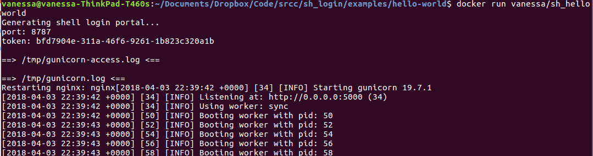
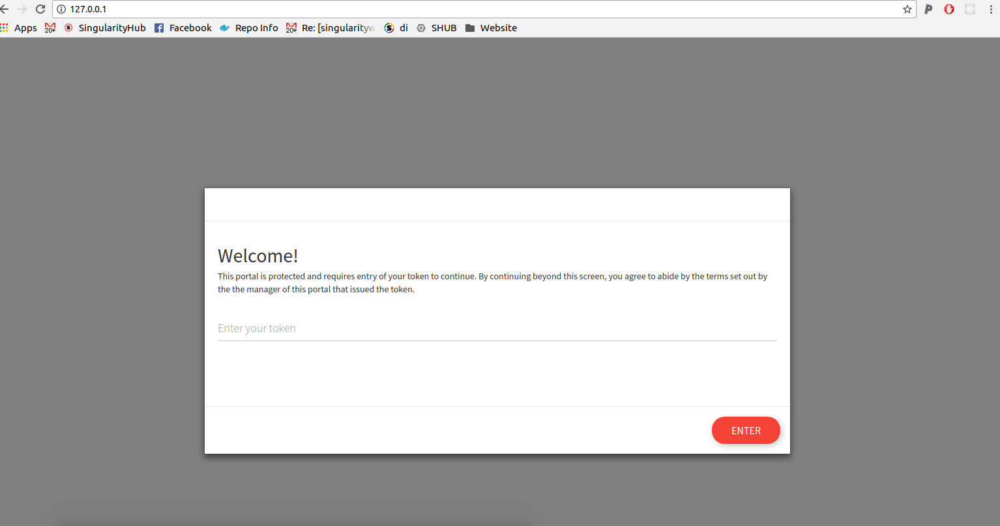
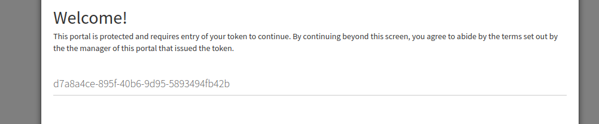
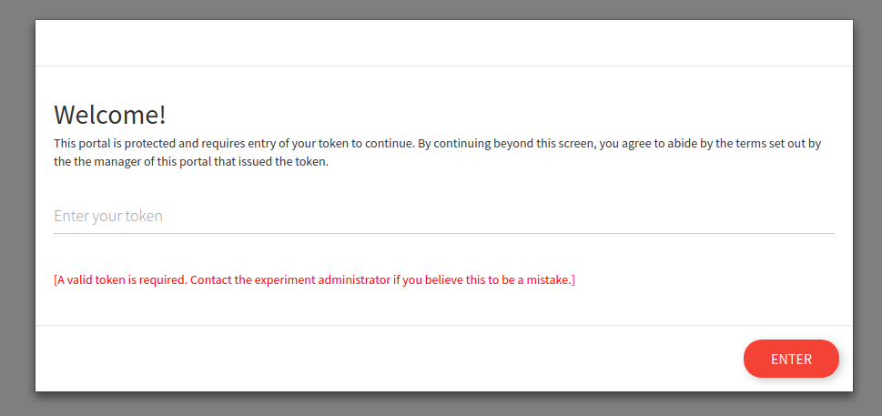
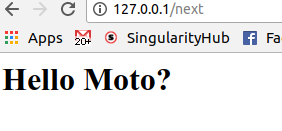

# Shell Login Portal

This is an experiment to provide a general web server to wrap access to
a particular port served by nginx. We do this by having the main nginx
root (/) serve as a proxy for the flask application, and then the Flask
application expects a particular environment variable (defined at runtime)
to check against a token provided by the user. If the token is correct,
the Flask response adds a header to authenticate it as so, and returns
the response to the user. If the response is incorrect, the user is 
returned permission denied (403). The user cannot go to the port to
bypass the application because of the proxy, and not exposing the port
directly. 

## Overview
The Singularity recipes and Dockerfiles in this repository build a base container that
can then be used for sub-applications that add some custom webby thing.
For example, we might add a jupyter notebook or rstudio server, and then use the
sh_login container to wrap it.

 - [Singularity](singularity) reviews issues with Singularity
 - [Docker](docker)

### Environment
The environment namespace has all variables beginning with `SH_LOGIN*` to not
interfere with any other namespace. These are defined in the script []()

```
SH_LOGIN_START="no";

# Port for Flask
SH_LOGIN_FLASK_PORT=5000

# Secret token to give to user
SH_LOGIN_TOKEN=$(uuidgen -r);

# Port for application to run (e.g., jupyter notebook)
SH_LOGIN_PORT=8787;

# Default nginx server port must be over 1200
SH_LOGIN_NGINX=$(( (UID*RANDOM)%55500 + 9000 ));

# Temporary directory for nginx and for user bind (needs writable)
SH_LOGIN_TMPDIR=$(mktemp -d /tmp/sh_login.XXXXXX) && rmdir ${SH_LOGIN_TMPDIR};

# Any command to run after the flask server is started
SH_LOGIN_CMD=''
```

### Interface
The user interaction looks like this:

The container is started in some terminal environment. Here is where the
token (and optionally port) would be generated, and shown to the user.



Starting the container and going to localhost shows a login screen requesting
a token.



The user now needs to enter the token they just saw.



If the token is wrong here, no go.



Then when the token is present, the user is taken to the protected port:




### Internal Flow

The flow then works like this:

```
# Startup 
[ start container ] --> ( generate token   --> ( show token to user
                          prepare server )       restart nginx with changes )
                                         

# Runtime
[ request to 127.0.0.1 ] --> [ token not found ] --> [ token portal ] --> [ token header ] -->
                         --> [ token found ] --> [ proxy to port based on header ] --> [ response to user ]
```

For the above, the flow of information happens through the Flask server, 
because we cannot find the token and need to ask for it. It's the Flask server
that internally fulfills the request and returns the content to the user, and this
means that the user cannot make the same external request unless explicitly adding
the same token to the request. 
